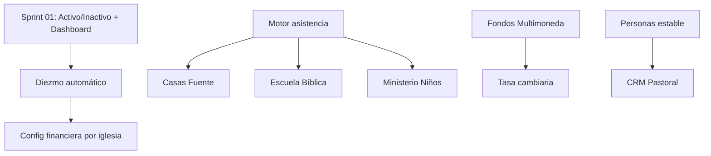

# Product Roadmap — EvoChurch

Roadmap derivado de [PRODUCT_STRATEGY.md](PRODUCT_STRATEGY.md).  
**El backlog detallado vive en PRODUCT_STRATEGY** — este documento organiza por fases y dependencias.

---

## Horizonte de planificación

| Horizonte | Enfoque |
|-----------|---------|
| **Ahora (cierre web Jul 2026)** | Validación Attendance Engine + cierre documental Sprint 01 |
| **Corto plazo (Q3 2026)** | P4 asistencia Flutter + finanzas críticas |
| **Mediano plazo (Q4 2026)** | Multimoneda + CRM pastoral avanzado |
| **Largo plazo (2027+)** | Automatización, IA, integraciones |

---

## Fase 0 — Fundación (completada / en curso)

Infraestructura multitenant, RBAC, módulos base.

| Capacidad | Estado |
|-----------|--------|
| Auth + sesión `sp_get_session_context` | ✅ |
| Miembros (CRUD, perfil, membresía) | ✅ |
| Finanzas (fondos, transacciones, contribuciones) | ✅ |
| Ministerios | ✅ |
| Eventos + comunicación | ✅ |
| Reportes (CEAD, Concilio, directorio) | ✅ |
| Red multi-sede (headquarters/campus) | ✅ |
| Perfil de iglesia + branding | ✅ |
| RBAC granular + roles custom | ✅ |
| EDK documentación | ✅ sincronizada 2026-07-21 |

---

## Fase 1 — Sprint 01 (cerrado)

**Objetivo:** Completar features críticas de personas y dashboard.

| Feature | EPIC | Estado | Prioridad |
|---------|------|--------|-----------|
| Estado Activo/Inactivo | 01 Personas | ✅ Web terminado; Flutter pendiente | 🔴 |
| Montos completos (Dashboard) | 06 Dashboard | ✅ Montos financieros reales; mocks no financieros pendientes | 🔴 |

Ver detalle: [../sprints/sprint-01/SPRINT.md](../sprints/sprint-01/SPRINT.md)

---

## Fase 2 — Finanzas transparentes

**Objetivo:** Automatizar distribución y preparar multimoneda.

| Feature | Dependencia | Prioridad |
|---------|-------------|-----------|
| Distribución automática del diezmo | — | 🔴 |
| Fondos Multimoneda | Arquitectura currency | 🟠 |
| Tasa cambiaria | Fondos Multimoneda | 🟠 |
| Configuración financiera por iglesia | Diezmo automático | 🟠 |

**Hito:** Tesorero registra diezmo una vez; sistema distribuye según reglas de la iglesia.

---

## Fase 3 — Attendance Engine

**Objetivo:** Un motor reutilizable — no módulos duplicados.

```
Motor genérico de asistencia (🔴)
    ├── Casas Fuente
    ├── Escuela Bíblica
    └── Ministerio de Niños
```

| Feature | Estado | Nota |
|---------|--------|------|
| Motor genérico de asistencia | ✅ Web terminado | Individual + agregado; piloto aprobado 2026-07-21 |
| Casas Fuente | ✅ Web terminado | Validado en piloto; móvil en P4 |
| Escuela Bíblica | ✅ Web terminado | Validado en piloto; móvil en P4 |
| Ministerio de Niños (asistencia) | ✅ Web terminado | Validado en piloto; móvil en P4 |

**Principio:** Una entidad `attendance_session` + configuración por tipo de actividad.

---

## Fase 4 — Ministerios autónomos

| Feature | Prioridad |
|---------|-----------|
| Ministerio de Niños (gestión) | ✅ Web |
| Fondos por Ministerio | ✅ Web |

**Hito:** Líder de ministerio opera su área sin acceso a finanzas globales.

---

## Fase 5 — CRM Pastoral

**Objetivo:** Cada miembro tiene una historia, no solo un registro.

| Feature | Estado |
|---------|--------|
| Timeline del miembro | 🧪 Validación web |
| Eventos relevantes (enfermedad, ayuda, discipulado…) | ✅ Web |
| Notas pastorales (privadas por permiso) | 💡 Idea |

**Dependencia suave:** EPIC 01 Personas estable.

---

## Fase 6 — Dashboard inteligente

| Feature | Estado |
|---------|--------|
| Montos completos | ✅ Web terminado |
| KPIs inteligentes (tendencias, riesgos, inactivos) | 💡 Idea |

---

## Fase 7 — Automatización

| Feature | Estado |
|---------|--------|
| Recordatorios automáticos | 💡 |
| Alertas financieras | 💡 |
| Alertas pastorales | 💡 |
| Seguimiento nuevos convertidos | 💡 |

---

## Fase 8 — Inteligencia Artificial

| Feature | Ejemplo |
|---------|---------|
| Preguntas en lenguaje natural | "¿Cuánto ofrendó Caballeros este año?" |
| Detección de tendencias | — |
| Predicción financiera | — |
| Asistente pastoral | — |

**Prerequisito:** Datos limpios en Fases 1–5.

---

## Ideas en evaluación (sin fase asignada)

No priorizadas — registrar en PRODUCT_STRATEGY antes de promover:

- Firma digital · Portal del miembro · Portal del líder
- App móvil del miembro · Integraciones bancarias · WhatsApp
- OCR de recibos · Concilios · Workflow Approval
- Inventario · Biblioteca · Reservación de recursos
- Agenda pastoral · Seguimiento de visitas

---

## Dependencias críticas



---

## Reglas del roadmap

1. Una feature **nunca** salta de 💡 Idea a 🚧 Desarrollo sin pasar por 📋 Backlog y 📝 Diseño.
2. Actualizar [PRODUCT_STRATEGY.md](PRODUCT_STRATEGY.md) al cambiar estado.
3. Nuevas ideas van primero a "Ideas en evaluación" — no al sprint.
4. Máximo 2–3 features 🔴 en desarrollo simultáneo.
5. Feedback de iglesia piloto documentado antes de ✅ Terminado.

---

## Documentos relacionados

- [PRODUCT_STRATEGY.md](PRODUCT_STRATEGY.md) — backlog con estados y prioridades
- [AI_PRODUCT_GUIDE.md](AI_PRODUCT_GUIDE.md) — cómo evaluar features
- [../sprints/sprint-01/SPRINT.md](../sprints/sprint-01/SPRINT.md)
