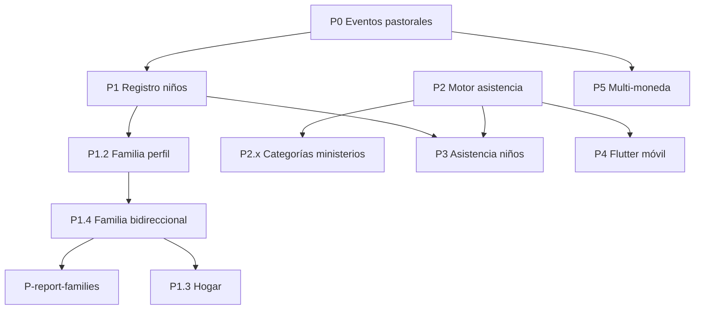

# Backlog post-reunión EvoChurch — Jul 2026

**Origen:** [Mejoras Propuestas Reunion Evochurch](a4002a1a-15f0-4020-98d2-70092847e3fc) (9 jul 2026).

**Objetivo:** Priorizar lo necesario para **operar ahora** en la iglesia, ordenado por impacto pastoral.

**Estado global:** Fases 1–3 de la reunión original ✅ cerradas. Este documento cubre el **backlog restante** + la pieza transversal del motor de asistencia.

---

## Resumen ejecutivo

| Prioridad | Ítem | Estado | Plataforma | Sprint est. |
|-----------|------|--------|------------|-------------|
| **P0** | Eventos pastorales del miembro | ✅ Cerrado (QA manual opcional) | Web | ~1 sprint |
| **P1** | Niños: registro + tutores | ✅ Cerrado (QA manual opcional) | Web | ~1 sprint |
| **P1.2** | Familia en perfil miembro | ✅ Cerrado (QA Jul 2026) | Web | ~0.5 sprint |
| **P1.4** | Familia bidireccional (padres + vincular hijo) | ✅ Cerrado (QA Jul 2026) | Web + BD | ~0.5 sprint |
| **P-report-families** | Reporte de Familias (hub) | ✅ Cerrado (QA Jul 2026) | Web + BD | ~0.5 sprint |
| **P1.3** | Hogar / household (opcional) | 📋 Backlog | Web + BD | ~0.5 sprint |
| **P2** | Motor de asistencia MVP | 🚧 Implementado en `feat/attendance-engine` (QA manual pendiente) | Web + Supabase | ~1–2 sprints |
| **P2.x** | Categorías de ministerios (Discipulado / Casas / …) | 📋 Decidido — tras P2 | Web + BD | ~0.5 sprint |
| **P3** | Niños: asistencia | 📋 Backlog | Web | ~0.5 sprint |
| **P4** | Asistencia móvil (casas fuente + estudios) | 📋 Backlog | Flutter + RPCs | ~1–2 sprints |
| **P5** | Fondos multi-moneda | 📋 Backlog | Web + BD | ~2 sprints |

### Ya entregado (reunión original)

| Ítem | Documento |
|------|-----------|
| Dashboard montos completos, fecha transacciones, estatus miembros | `AGENT-PROMPT-FASE-1-REUNION.md` |
| Salud, oficios, empleo | `AGENT-PROMPT-FASE-2-REUNION.md` |
| Cierre semanal diezmos 70/15/15 | `AGENT-PROMPT-FASE-DESCUENTOS-DIEZMO.md` |

---

## Principios de priorización

1. **Impacto pastoral inmediato** antes que infraestructura financiera avanzada.
2. **Web primero** cuando no requiere Flutter.
3. **Motor de asistencia único** (ADR-006) — no módulos duplicados por actividad.
4. **Registro de niños** separado de **asistencia de niños** (esta última depende del motor).
5. **Multi-moneda al final** — alto blast radius; la iglesia puede operar en DOP mientras tanto.

---

## P0 — Eventos pastorales del miembro

**Problema:** No hay forma de documentar enfermedades, emergencias (incendio), recolectas u otros eventos relevantes en la historia del miembro.

**Distinto de:** `/eventos` (calendario de cultos/actividades) y `pastoralNotes` (texto libre en perfil).

**Prompt agente:** `AGENT-PROMPT-PASTORAL-EVENTS.md`

### Alcance MVP

- Tabla `profile_pastoral_event` multitenant (`church_id` + RLS).
- Tipos: enfermedad, accidente, pérdida familiar, ayuda económica, emergencia, recolecta, reconocimiento, discipulado, otro.
- Timeline en pestaña **Membresía** del perfil (no mezclar con `/eventos` ni dashboard eventos).
- Permisos: lectura `members:read`, escritura `members:write`.
- Audit log en mutaciones.

### Fuera de alcance P0

- Vínculo automático a contribuciones/recolectas financieras.
- Reporte global de eventos por período (P0.1 futuro).
- Portal auto-servicio del miembro.

### DoD

- [x] Migración SQL creada (`20260711120000_profile_pastoral_events.sql`)
- [x] Timeline en Membresía (`/members/profile?id=…&tab=membership`)
- [x] Crear / editar / eliminar evento (UI + actions)
- [x] i18n es/en/fr + audit `pastoral_event.*`
- [x] `npm run build` exit 0
- [x] Migración aplicada en Supabase remoto (`20260711120000`)
- [ ] QA manual en staging (opcional)

---

## P1 — Ministerio de niños: registro

**Prompt agente:** `AGENT-PROMPT-CHILDREN-REGISTRY.md`

**Problema:** No hay perfiles de niños vinculados a tutores/padres.

### Alcance

- Extensión de `profiles` con `is_child` + tabla `profile_child_guardian`.
- Campos: nombre, fecha nacimiento, alergias, contacto emergencia, notas (`bio`), tutores.
- Listado y CRUD en `/members/children`; menú Miembros ▾.
- Permisos v1: `members:read` / `members:write`.

### Fuera de alcance P1

- Asistencia de niños (→ P3).
- Vista familia unificada (→ P1.2).
- Hogar formal (→ P1.3).

### DoD

- [x] Migración SQL (`20260713120000`, `20260713153000`)
- [x] CRUD niño + tutores
- [x] Listado excluye niños de adultos (`spgetprofiles`)
- [x] i18n + audit `child.*`
- [x] `npm run build` exit 0
- [ ] QA manual en staging (opcional)

---

## P1.2 — Familia en perfil de miembro

**Prompt agente:** `AGENT-PROMPT-MEMBER-FAMILY.md`

**Mockup (Figma-like):** [`mockup/member-family-mockup.html`](../mockup/member-family-mockup.html) — abrir en navegador; barra inferior = vistas A–E.

**Problema:** Papá y mamá son miembros; tres hijos en registro infantil. Hoy no hay una vista que una la familia ni alta contextual de hijos.

**Caso referencia:** Juan + María Pérez, hijos José (9), Ana (7), Luis (2).

### Alcance MVP

| Vista mockup | Entrega |
|--------------|---------|
| **A** Familia en perfil adulto | Pestaña `Familia`: cónyuge + hijos + CTAs |
| **B** Familia vacía | Estado sin cónyuge/hijos |
| **C** Detalle niño | Tutores clicables → perfil adulto (mejora P1) |
| **D** Listado niños + columna familia | Opcional / baja prioridad |
| **E** Drawer registrar hijo | Mismo drawer P1; tutores pre-cargados |

### Modelo

- **Cónyuge:** `profile_spouse` (adulto ↔ adulto, misma iglesia).
- **Hijos:** consulta inversa `profile_child_guardian` (sin duplicar datos) — evolucionó en **P1.4** a `profile_parent_child`.
- **UI:** pestaña en `/members/profile?id=…&tab=family` — **no** módulo `/familias` en menú.

### Fuera de alcance P1.2

- Tabla `household` / dirección compartida (P1.3).
- Hermandad entre hermanos, graduación niño→miembro.
- Jóvenes como entidad aparte (siguen en miembros si son `is_member`).

### DoD

- [x] Mockup validado (opcional)
- [x] SQL cónyuge + `sp_get_member_family`
- [x] Pestaña Familia + vincular cónyuge
- [x] Lista hijos + registrar desde familia
- [x] i18n es/en/fr
- [x] `npm run build` exit 0
- [x] Migración aplicada en remoto (`20260713180000`)
- [x] **QA Jul 2026** (2026-07-13) — cerrado en código; browser opcional (ver nota abajo)

**Nota QA Jul 2026:** Verificación estática OK (`MemberFamilyTab`, `SearchableSelect`, `key={member.memberId}` en shell, i18n). Checklist browser: *no ejecutado en browser — verificado en código*. `npx tsc --noEmit` ✅ + `npm run build` ✅ (tras liberar `.next` de builds concurrentes).

---

## P1.4 — Familia bidireccional (padres + vincular hijo existente)

**Problema:** P1.2 solo miraba “abajo” (cónyuge + hijos). Falta ver **padres** en la ficha del hijo adulto y vincular hijos ya registrados (miembro o ministerio infantil) sin recrear perfiles.

### Alcance

- Tabla `profile_parent_child` + RPCs `sp_link_parent_child` / `sp_unlink_parent_child`.
- `sp_get_member_family` incluye `parents[]` (directos + cónyuge del padre/madre como co-padre/madre inferido).
- UI: bloque Padres; CTA “Vincular hijo/a existente” + `SearchableSelect`; botones agrupados (vincular vs crear).
- Fix navegación padre→hijo: `key={member.memberId}` en `MemberProfileShell` + reset de tab al cambiar perfil (evita skeleton/cards vacías).

### Migraciones

- `20260713190000_profile_parent_child.sql`
- `20260713200000_member_family_parents.sql`

### DoD

- [x] SQL `profile_parent_child` + link/unlink RPC
- [x] Padres en pestaña Familia (incl. cónyuge inferido)
- [x] Vincular hijo existente + crear menor + crear miembro
- [x] SearchableSelect cónyuge e hijo
- [x] Navegación entre perfiles sin empty cards
- [x] i18n es/en/fr
- [x] **QA Jul 2026** (2026-07-13) — cerrado en código; browser opcional
- [x] `npm run build` exit 0 (2026-07-13)

**Riesgos residuales:** QA browser en staging pendiente; padres solo en perfiles adultos (`is_child = false`) — menores del ministerio siguen en `/members/children/[id]` con tutores P1.

---

## P-report-families — Reporte de Familias (hub Reportes)

**Mockup:** [`mockup/family-report-mockup.html`](../mockup/family-report-mockup.html) (A listado, B ficha, C vacío, D imprimible).

**Estado:** ✅ Cerrado (QA Jul 2026)

Hogares derivados de `profile_spouse` + `profile_parent_child` (sin entidad household P1.3). Entrada en hub Reportes + rutas dedicadas. Permiso: `members:read` (+ acceso hub reportes). Dedup cónyuges: `anchor = LEAST(uuid)`.

### DoD

- [x] Listado + ficha (`/reports/families`, `/reports/families/[id]`)
- [x] RPCs `sp_list_family_households` / `sp_get_family_household`
- [x] Dedup hogares cónyuges
- [x] i18n es/en/fr + link desde pestaña Familia
- [x] Hub entry `family-households` → navigate a `/reports/families`
- [x] Permisos: hub `canAccessReportsHub`; página + `canReadMembers`
- [x] Migración `20260713210000_family_household_report.sql`
- [x] **QA Jul 2026** (2026-07-13) — cerrado en código; browser opcional
- [x] `npm run build` exit 0 (rutas `/reports/families` y `[id]` generadas)

**Nota QA Jul 2026:** Código completo (pages, list/detail views, actions, service, catalog, CSS). Checklist browser: *no ejecutado en browser — verificado en código*.

**Riesgos residuales:** `family-households` no es fila en matriz `REPORT_RESOURCE_DEFS` (usa `members:read` especial, como audit); exportación PDF del hub lanza error intencional (ruta dedicada + CSV/print en UI). Confirmar migración aplicada en remoto si aún no se hizo push.

---

## P1.3 — Hogar / household (futuro)

**Depende:** P1.2 / P1.4 estables.

- Entidad `household` (nombre opcional, dirección compartida).
- `profile_household` para agrupar adultos e hijos.
- ~~Reportes / directorio por familia.~~ → cubierto en espíritu por **P-report-families** (sin tabla household).
- Solo si la iglesia lo pide tras usar P1.2 / P1.4.

---

## P2 — Motor de asistencia MVP

**Análisis + prompt agente:** [`ANALISIS-Y-PROMPT-MOTOR-ASISTENCIA.md`](./ANALISIS-Y-PROMPT-MOTOR-ASISTENCIA.md)  
**Estado:** ✅ Análisis Modo A aprobado (2026-07-13) → **Modo B** en rama `feat/attendance-engine`.

**Problema:** Casas fuente, estudios bíblicos y niños necesitan registrar asistencia sin duplicar código.

**Referencia:** EPIC 03 / ADR-006 en `.evo/architecture/DECISION_LOG.md`.

### Modelo (aprobado)

- Casa / estudio / escuela dominical = filas de **`church_ministries`** (no tablas nuevas).
- Sesión: `activity_type` + **`ministry_id`** (roster = checklist).
- Hub `/attendance` con presets casa / estudio.
- Permisos: `attendance:read` / `attendance:write`.
- Children checklist → P3. Categorías de ministerios (Discipulado…) → **P2.x**.

### Alcance

- Tabla `attendance_session` (fecha, tipo, `ministry_id`, evento opcional, church_id).
- Tabla `attendance_record` (session_id, profile_id, status: present/absent/late).
- RPCs: crear sesión, marcar asistencia, listar por sesión/período.
- UI web: listado + crear sesión + checklist del **roster del ministerio**.
- Tipos: `house_group`, `bible_study`, `children`, `service`.

### DoD

- Staff registra asistencia de una sesión desde la consola web (roster del ministerio).
- Casas / estudios son ministerios + `activity_type` de sesión — **no** módulos separados.

---

## P2.x — Categorías de ministerios (siguiente, no este sprint)

**Decidido en producto (2026-07-13); no implementar en P2.**

- `ministry_category` (ej. Discipulado, Casas fuente, Niños, Adoración, Otro).
- Estudios martes / jueves de enseñanza / escuela dominical = ministerios bajo **Discipulado**.
- Mejora filtros en `/ministerios` y presets/picker de asistencia.
- **No** crear módulo CRUD “Discipulado/Estudios” aparte (piel filtrada OK después).

---

## P3 — Niños: asistencia

**Depende:** P1 + P2.

- Sesiones de tipo `children` vinculadas al ministerio de niños.
- Checklist de niños registrados (no todos los miembros adultos).

---

## P4 — Asistencia móvil (Flutter)

**Depende:** P2 (RPCs estables).

- App Flutter: tomar asistencia en campo para casas fuente y estudios bíblicos.
- Mismas RPCs que la consola web.
- Repo: `evochurch` (Flutter), fuera de este repositorio.

---

## P5 — Fondos multi-moneda

**Problema:** Fondos en USD con tasa de cambio.

**Referencia:** `.evo/product/PRODUCT_ROADMAP.md` Fase 2 finanzas.

### Alcance (cuando se ejecute)

- `currency_code` en fondos (DOP/USD).
- Tasa de cambio por iglesia o por fecha.
- Montos en moneda del fondo; conversiones en reportes y dashboard.

### Riesgo

Toca fondos, contribuciones, transacciones, reportes — **no iniciar** hasta P0–P2 estables.

---

## Dependencias



---

## Orden de ejecución recomendado

1. ~~**P0** — Eventos pastorales~~ ✅
2. ~~**P1** — Registro niños~~ ✅
3. ~~**P1.2** — Familia en perfil~~ ✅
4. ~~**P1.4** — Familia bidireccional~~ ✅
5. ~~**P-report-families** — Reporte Familias~~ ✅
6. **P2** — Motor asistencia web ← actual (`feat/attendance-engine`)
7. **P2.x** — Categorías de ministerios (Discipulado / Casas / …)
8. **P3** — Asistencia niños
9. **P4** — Flutter casas fuente + estudios
10. **P5** — Multi-moneda
11. **P1.3** — Hogar *(si hace falta tras P1.2/P1.4)*

---

## Cómo usar con agentes

```
@mejoras/BACKLOG-POST-REUNION-JUL2026.md
@mejoras/ANALISIS-Y-PROMPT-MOTOR-ASISTENCIA.md   # P2: análisis ✅ → modo B ejecución

Lee primero .evo/engineering/AI_ENGINEERING_GUIDE.md (obligatorio).
Modo A: solo análisis / Go-No-Go. Modo B: implementar (decisiones §5 del análisis). Diff mínimo. npm run build al final.
```

---

## Sincronización con EDK

| EDK | Este backlog |
|-----|--------------|
| EPIC 05 CRM Pastoral | P0 ✅; P1.2 ✅; P1.4 ✅; P-report-families ✅; P1.3 hogar futuro; reporte agregado P0.1 futuro |
| EPIC 03 Attendance | P2–P4 (+ P2.x categorías ministerios) |
| EPIC 04 Ministerio Niños | P1 ✅ + P1.2/P1.4 familia + P3 asistencia |
| Fondos Multimoneda | P5 |

Actualizar `PRODUCT_STRATEGY.md` cuando P0 cierre.
